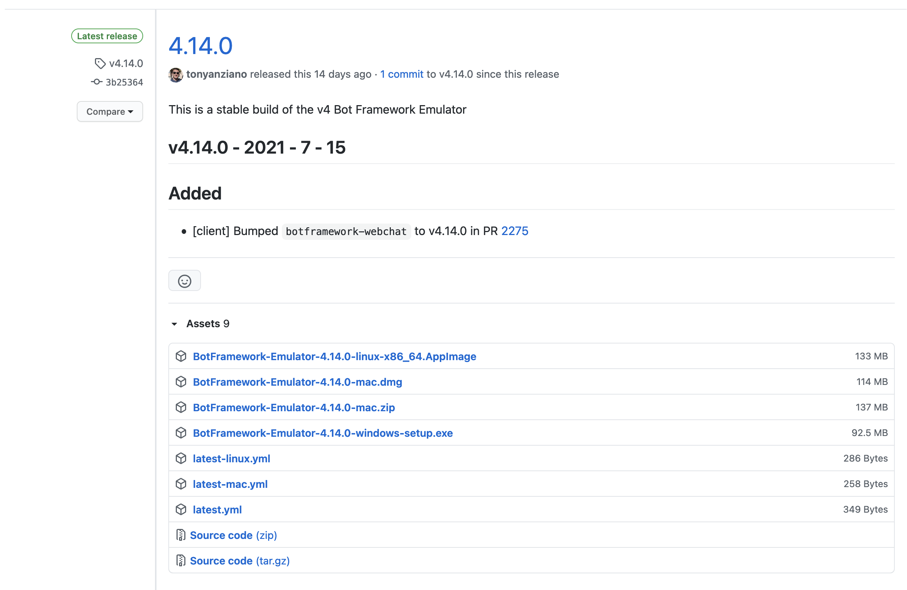

In this article, we're going to setup a Microsoft BotFramework bot that runs on your local machine and can be tested through the Bot Framework emulator.

This will eventually be the first in a series of tutorial articles that will help you develop and test a simple chatbot using the Microsoft Bot Emulator.

We're going to be using the `node.js` flavour for these tutorials, but Microsoft does have `C#`, `Java`, and `Python` versions as well.  

## Table of contents 

1. Install the Bot Framework Emulator
2. Setup a Simple Echo Bot 
3. Test the bot 
4. Next Steps
5. Further Reading

## Install the Bot Framework Emulator

Bot Framework Emulator is a desktop application that allows developers to test and debug bots, either locally or remotely. Using the Emulator, you can chat with your bot and inspect the messages that your bot sends and receives. The Emulator displays messages as they would appear in a web chat UI and logs JSON requests and responses as you exchange messages with your bot.

The emulator is the best way to test your bot before deploying it to a live server. 

[Bot Framework Emulator Readme](https://github.com/Microsoft/BotFramework-Emulator/blob/master/README.md)

### Step 1: Download Release Package 



Download the latest Bot Framework V4 Emulator for your platform from the [GitHub releases](https://github.com/Microsoft/BotFramework-Emulator/releases/latest) page.


### Step 2: Install 

Installation is very simple - just download the emulator for your specific platform. 

On a Mac, the installation file downloads and then unpacks itself. 


And then presents you with the app installer so that you can add the app to your applications folder. 


Other operating systems will have a slightly different installation process. 


### Step 3: Run 

Find the app icon and launch the Bot Framework Emulator:


This is what the emulator looks like at first launch:


Well done! You've completed the first step. 

Since we don't have an actual bot running, we don't have anything to test just yet - so that's what we'll do in the next step - set up a simple echo bot. 

## Setup a Simple Echo Bot 

Microsoft has a done a great job of building a bunch of sample bots that we can use to learn and build out our bots. 

We're going to use their existing `Echo bot` sample to setup a local bot and test that it works with our emulator. This sample accepts a message from a user and then replies back with that message. This sample is great to confirm that the bot works locally and that messages are moving around properly. 

In future tutorials we'll explore how to make more complicated conversation flows, but for now we're just starting with the echo bot. 

### Prerequisites

* You will need `node.js` version 10.14 or higher installed on your machine before you can go further.
* [Visual Studio Code](https://www.visualstudio.com/downloads) or your favorite IDE.

### Step 1: Clone the samples repository

```
git clone https://github.com/microsoft/botbuilder-samples.git
```

### Step 2: Find the echo bot sample

In a terminal, navigate to `samples/javascript_nodejs/02.echo-bot`

```
cd samples/javascript_nodejs/02.echo-bot
```

### Step 3: Install the npm modules

```
npm install
```

### Step 4: Start the bot

```
npm start
```


Well done! You've completed the second step. 

We now have our emulator installed, and our bot running, so everything we need to interact with our bot is ready to go. 

## Test the bot 

The last step is to connect to the bot using Bot Framework Emulator.

### Step 1: Launch Bot Framework Emulator

Launch Bot Framework Emulator.


### Step 2: Open a Bot

Hit the Open Bot button.


### Step 3: Provide the Bot URL

Enter a Bot URL of http://localhost:3978/api/messages and hit connect.


Our simple echo bot doesn't have any authentication setup, so you don't need to provide an app ID or app password, and thus leave all the fields blank. 


### Step 4: Interact with the bot

You can now send messages to the bot and the bot will echo back what you sent. 


If your screen doesn't look like the one above, it's possible something went wrong. Double check that your bot is running, and that you have the correct port number in the open bot dialog. 


## Next Steps

This is the most basic bot, and not something we could really put into production. 

The next steps are to start building out useful a conversational UI, and then deploy it so people can actually use it, all of which will come in future tutorials.


## Further Reading

- [Bot Framework Documentation](https://docs.botframework.com)
- [Bot Basics](https://docs.microsoft.com/azure/bot-service/bot-builder-basics?view=azure-bot-service-4.0)
- [Activity processing](https://docs.microsoft.com/en-us/azure/bot-service/bot-builder-concept-activity-processing?view=azure-bot-service-4.0)
- [Azure Bot Service Introduction](https://docs.microsoft.com/azure/bot-service/bot-service-overview-introduction?view=azure-bot-service-4.0)
- [Azure Bot Service Documentation](https://docs.microsoft.com/azure/bot-service/?view=azure-bot-service-4.0)
- [Azure CLI](https://docs.microsoft.com/cli/azure/?view=azure-cli-latest)
- [Azure Portal](https://portal.azure.com)
- [Channels and Bot Connector Service](https://docs.microsoft.com/en-us/azure/bot-service/bot-concepts?view=azure-bot-service-4.0)
- [Restify](https://www.npmjs.com/package/restify)
- [dotenv](https://www.npmjs.com/package/dotenv)
