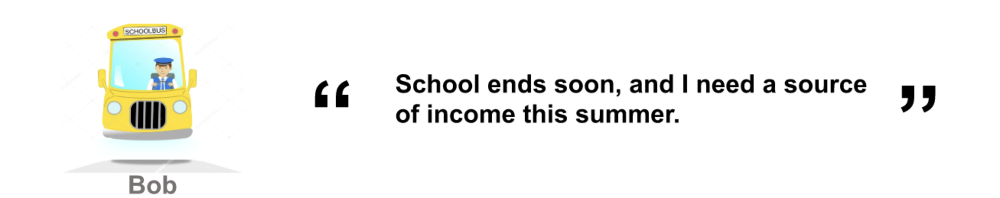
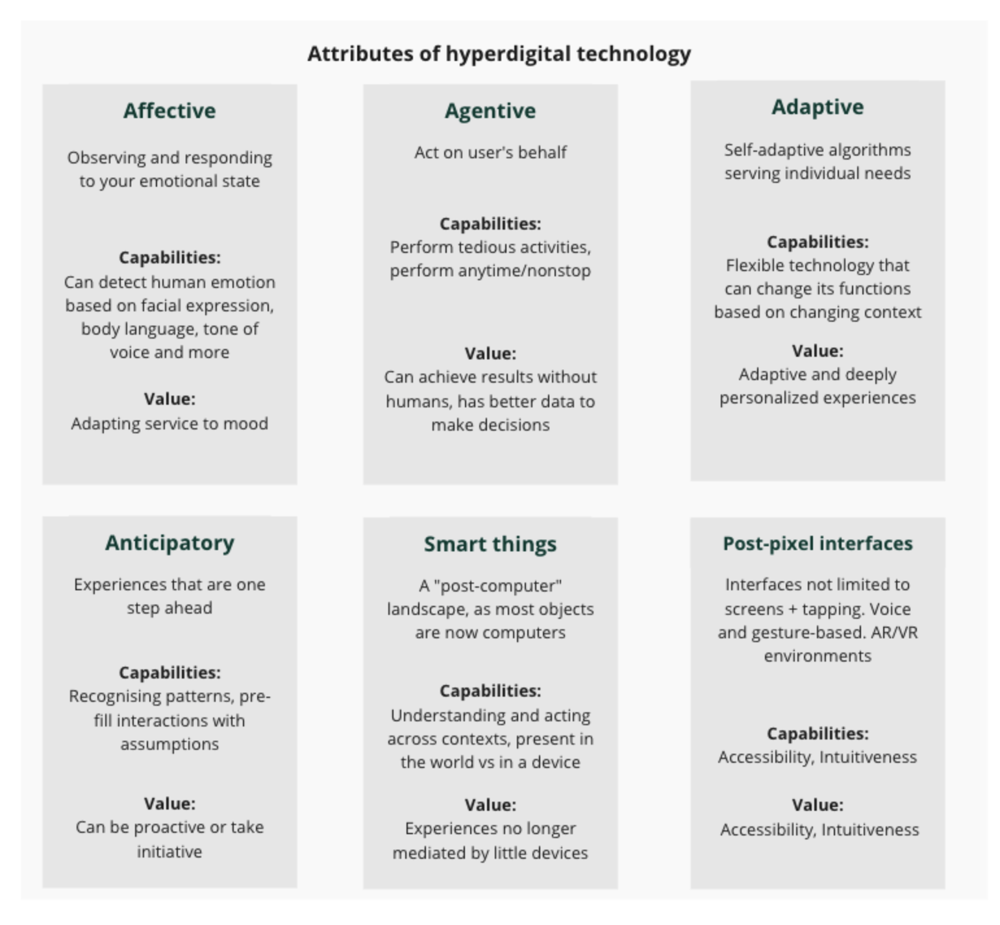
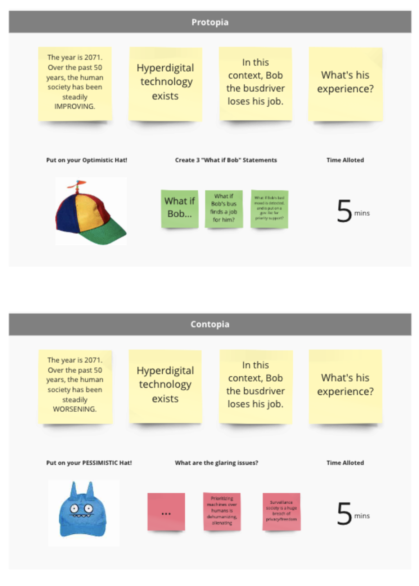
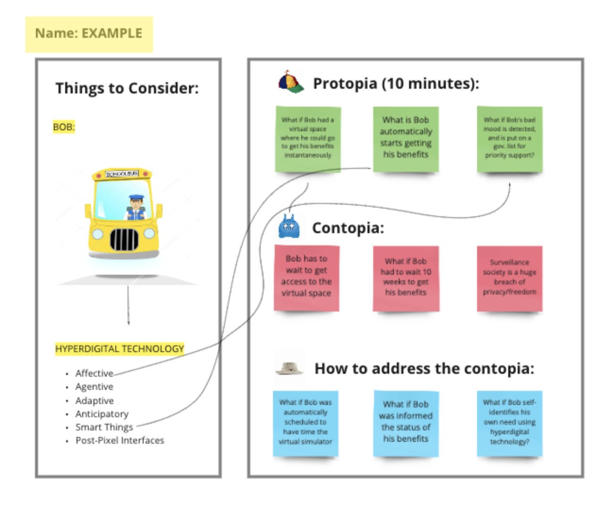
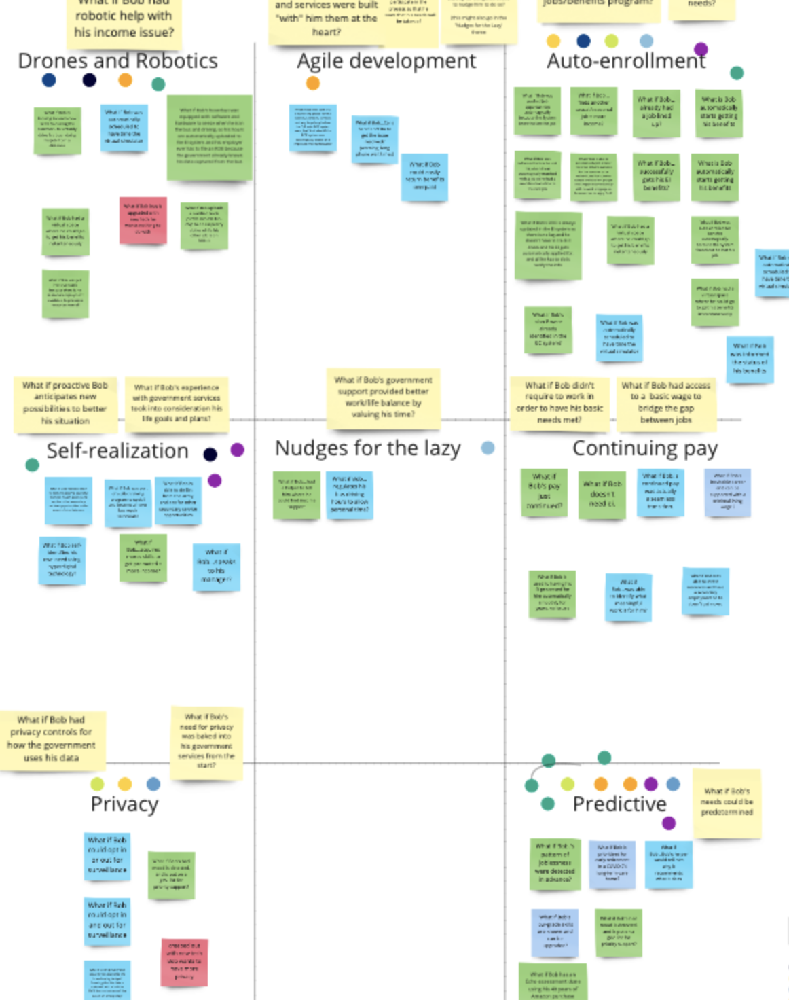

It’s day one of our Speculative Design Sprint and the energy in the room is spirited. 

We’ve got a cross-functional team from across the Digital Experience and Client Data workstream to come together to explore what the future of the virtual concierge could look like.

We’re defining the future virtual concierge as “something that helps clients navigate complexity in the future”.

Our goal for Day One of the sprint is simple: Map out some scenarios of the future so that we may find a problem space to work within.

## The Kickoff

Day one kicked off with a round of introductions. Our sprint team was made up of folks from across the Digital Experience and Client Data workstream, so we introduced ourselves and each answered the question:

> What is one thing you like that has nothing to do with your job?  What do you think that thing will like like 50 years from now, in an optimistic future?

This question was designed to get the team loosened up, and used to the idea of a "Protopia", that is, an optimistic future where things are not perfect (which is a Utopia), but where things are pretty darn good.

## Meet Bob

We then introduced our Persona, Bob the hoverbus driver. Bob's persona was developed by the Customer Experience team to personify research done into seasonal workers. Bob's work dries up each summer when kids are no longer in school. 

Bob the Hoverbus Driver

## The "Hyperdigital Channel"

We introduced our participants to the guiding question of our sprint:

**What does guiding and supporting Bob on the "hyperdigital channel" look like?**

The "hyperdigital channel" is just something we made up - it's name for "technology of the future". Our hope is that by giving it this name, we could encourage our participants to leave behind present understandings of technology and think creatively about what could be.

 

## What If? Questions

If you're familiar with design thinking, you probably know about "how might we" questions - well, "what if" questions are the Speculative Design equivalent.

We asked our participants to take everything we'd laid out (the Protopia, Bob and the Hyperdigital channel) and use it to start generating some what if questions. We also explored some alternative scenarios, like the "Contopia" and "Designing against the Contopia".

## Identifying Themes and Voting

We took all the "What If" questions and, as a team, identified themes and categorized all the cards under those themes. Then, it was time for voting:

Each participant got two votes. We brought in two "Deciders", Claudine Fugere and David Todd, who got four votes each. At the end of voting, we'd identified the guiding theme for the remainder of our sprint: **Predictive**. That meant we'd identified the following target for the remainder of our sprint:

**What if Bob’s needs could be predetermined via a future virtual concierge? How might that help us guide Bob through the hyperdigital channel?**

That brought us to the end of Day 1! Spirits were high and we were ready for Day 2: Sketching.
