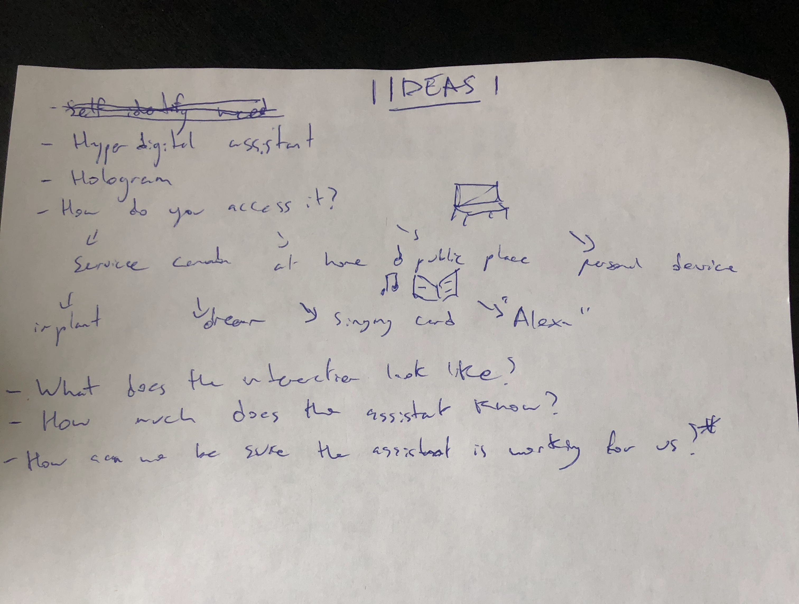
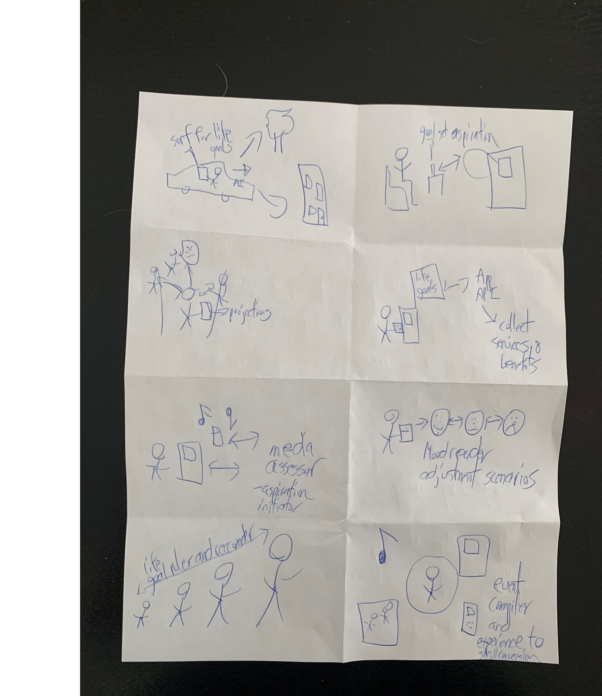
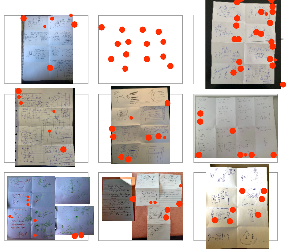
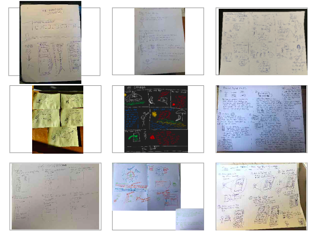

## Time to get those Creative Juices Flowing!

Enough talk, day two was bringing our ideas to life through some solution sketching. 

The sketches answered the question we had asked the previous day:

**What if Bob’s needs could be predetermined via a future virtual concierge? How might that help us guide Bob through the hyper-digital channel?**

To inspire some creativity, we had asked everyone to bring some pencils and paper to the activity. Sometimes to create something new you need to get a little old school.

## Ideas

We started the day off by individually writing down some ideas. These written ideas would then help us create our solutions further on.

These ideas were prompted by questions such as: 

What does the virtual concierge look like? What was the environment Bob accessed these services like? 

## Crazy 8’s

Once we had some ideas written down. We proceeded with Crazy 8’s. We asked each participant to fold their paper into 8 pieces. Each participant then had eight minutes to draw eight different solutions. This is when the Ideas activity came into play - after two or three unique ideas, the mind goes blank! That's why having your Ideas notes nearby is a good idea.

Crazy 8's is a creative exercise to push sprint participants out of their comfort zone and to inspire out-of-the-ordinary solutions.

## Heat Mapping

Now that had some sketches, we shared the sketches anonymously on the Miro Board and had participants do a bit of heat mapping. This heat mapping enabled participants to look at the ideas others had worked on and add stickers to the ones that they found most intriguing.

An interesting challenge: Participants were not allowed to explain their designs and the heat mapping was done completely anonymously.

## Solution Sketching

Participants were asked to use one of their Crazy 8 designs to flesh out into a fully-fledged Solution Sketch.

At the end of the day, we had 9 Solution Sketches for our experts to critique the next day. 

