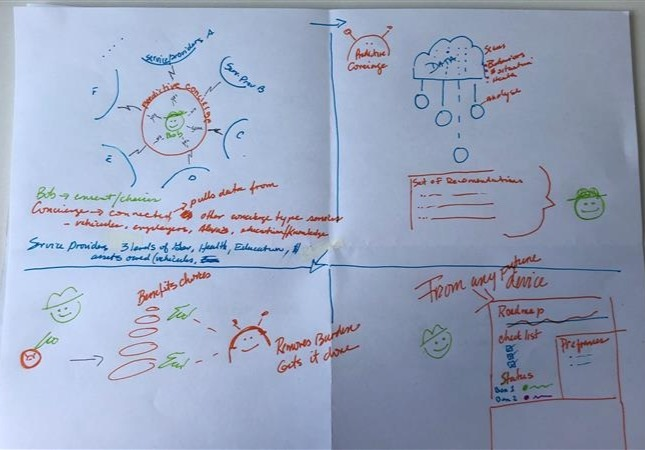

By day three, we had nine Solution Sketches but we knew we'd only have time to prototype and test one. To help us decide, we went into two rounds of design critique. The first was led by our futurism experts, Pia Andrews and Eric Ward. The second was an internal critique, leveraging the knowledge of the various sprint participants.

## Round 1: Ask the Futurists

We were lucky to have two highly knowledgeable futurists in our orbit: Pia Andrews and Eric Ward.

### Pia Andrews

Pia Andrews is our resident futurist and the Director General of Digital Experience and Client Data workstream. Since Pia was the one who initially inspired us for this sprint we thought it was apt to have her come in and push our thinking forward. 

### Eric Ward

Eric Ward is the Senior Director of Policy Horizons. Policy Horizons works to help the Government of Canada develop future-oriented policy and programs that are more robust and resilient in the face of disruptive change on the horizon using foresight. 

The futurists spent 5 minutes critiquing each of the nine Solution Sketches, and gave us insights to improve our designs. They pushed us to go further in our conceptions of the future. Represented in emoji form, the conversation was 🤯

## Round 2: Internal Critique

The next round of critiques came from the sprint participants themselves.  We had subject matter experts representing different teams across the Digital Experience and Client Data workstream, and we wanted to hear their insights. We had perspectives coming from the strategic governance side, the data side, the frontline perspective, the agent side, and more. 

This was the first time the sprint participants were allowed to present and comment on their Solution Sketches. This felt a bit odd to many of the participants, who naturally wanted to explain their ideas, beyond what appeared on the page. Alas, the design sprint leaves very little time for that type of conversation; 'unnatural but efficient' is probably the best descriptor for Day 3.

## Deciding

With the critiques finished, it was time to choose: which of the nine solution sketches would be the winner?

Each of the sprint participants cast a vote through the straw poll. Their votes didn't directly count - the purpose of the straw poll was the show our deciders (David Todd and Claudine Fugère) the direction the team was leaning. 

Armed with the knowledge from our futurists, our internal critique, and our straw poll, Claudine and David cast their "supervotes". When the dust had settled, a single winner had emerged: "The Predictive Concierge"

The author of this sketch had imagined an impressive concierge - here is a brief description:

 The "Predictive Concierge" acts as an intermediary between the user and various service providers (of which we at Employment and Social Development could be one). It has access to a vast amount of data, provided both from the user and the various service providers. It uses that data to come up with recommendations for the user. It is an omnichannel concierge, meaning that it can be accessed across various mediums and devices. 

So we had a winner! With that, we wrapped day 3 and prepared ourselves for Day 4: Storyboarding.
