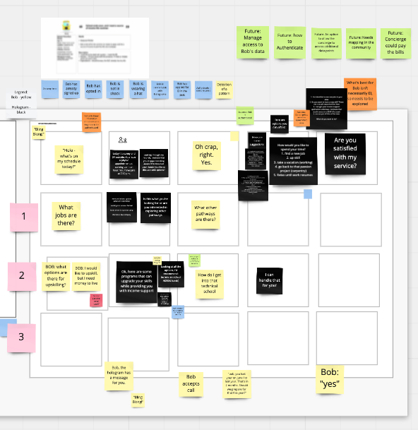
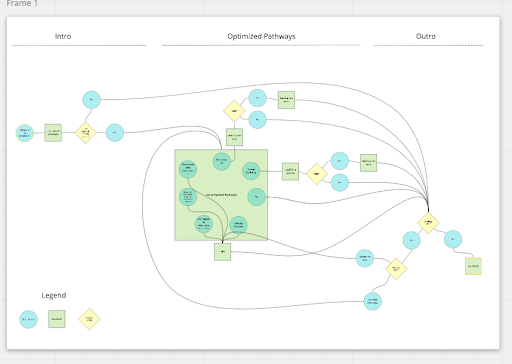

## Just like they do in the movies!

Day four was all about storyboarding the interaction between our predictive concierge and our persona, Bob. Yep, storyboarding - creating a panel by panel representation of the interaction, like a comic book. This is when things started to go from "far-out-big-picture" to "concrete-thing-in-the-world".

## From omnichannel to a single interaction

The winning solution sketch was visionary. It imagined a predictive concierge working with various service providers across various channels. But given our time limitations, we were forced to prototype a single interaction. Inspired by Eric Ward's ideas from day 3, we decided to go with a hologram. 

We then had to ask ourselves some basic questions. How would the interaction begin? Would Bob initiate it or would the hologram? What would be said? How would the hologram offer holisitic advice to Bob in his time of need?

We found that they best way to get at these answers was to do some role-playing. We had one member of the group act as Bob, while the rest of the group improvised in the role of the concierge. We captured the ideas in real time, and over the course of 2 hours, our storyboard began to take shape.

## From storyboard to user flow

The storyboard implied an information architecture which would govern the beginning, middle and end of Bob's interaction. It was constrained enough to be prototypeable, but open enough to allow user freedom, which would be invaluable for our user testing. To create alignment among the sprint participants, Team Toad turned the storyboard into a user flow document, as seen below.

With the user flow in place, we were ready for Day 5 and 6: prototyping.
