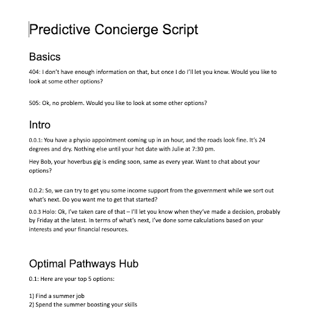
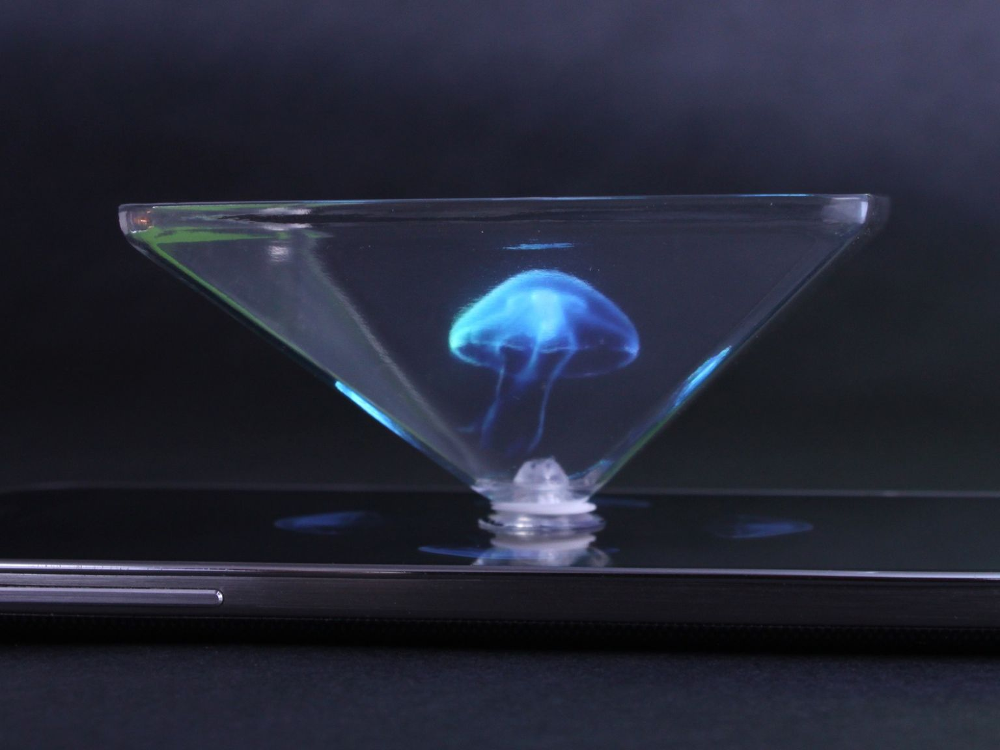
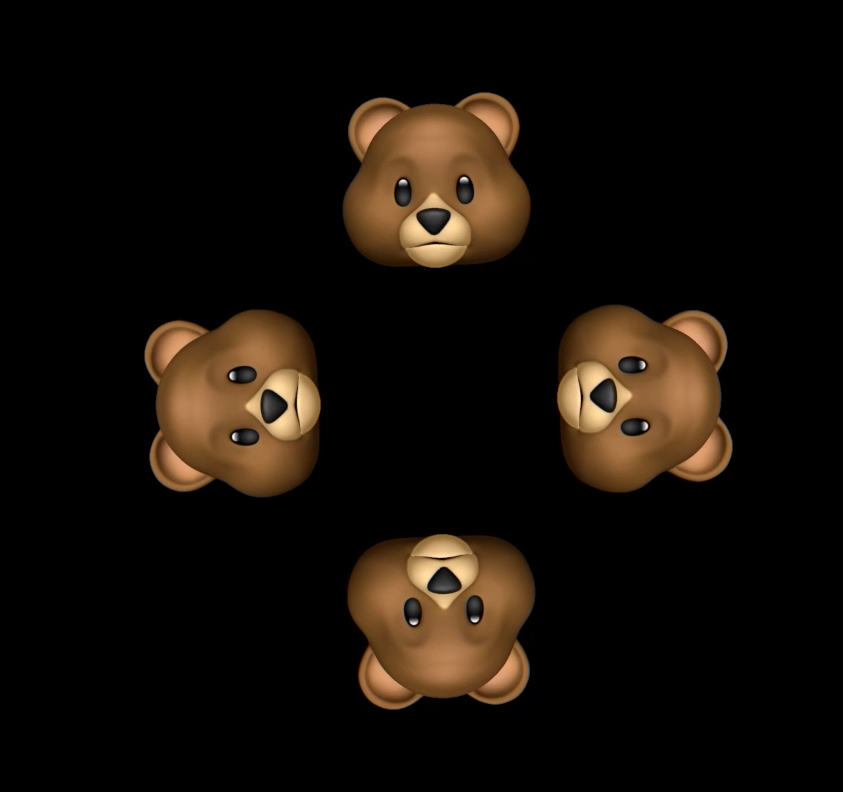
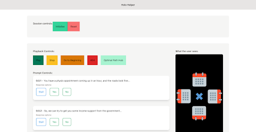

## Production Time!

The mood in the air was electric as we kicked off our prototyping activities. Pulling from my background in theatre, I can say it's very much the same feeling you have when you realize the audience is coming in two days and you don't even have a script yet.

We divided ourselves into 3 categories: script-writing, visual design, and technologisitics. 

### Script-writing

Using the story-board and the user flow document as a guide, the script-writers first made sure they understood all the different paths a user could take through the prototype. They developed a script for every part of every possible interaction. They played with the language to make sure the tone was right. Finally, casting themselves as the concierge, they tested the script with 3 people not involved in the script-writing before handing it off.

### Visual Design

The visual design team was responsible for the look and feel of the concierge. First, they had to decide how to prototype a holograph. A bit of googling surfaced the existence of the "hologram pyramid":

A hologram pyramid is nothing more than a piece of clear plastic, that, when placed on a phone and used with a special kind of video, produces an effect of a hologram. Team Toad quickly ordered hologram pyramids for all the users we would be testing with, via express mail.

The visual design team took the script, and using the animoji feature on new iphones, creating a recording of a bear reading through the script:

<iframe width="560" height="315" src="https://www.youtube-nocookie.com/embed/p462PnsIIHc" frameborder="0" allow="accelerometer; autoplay; clipboard-write; encrypted-media; gyroscope; picture-in-picture" allowfullscreen></iframe>

Finally, they turned it into a "hologram video":

## Techologistics

The question of how to control the hologram in a remote testing environment posed quite a challenge. Evidently, we were not going to have time to create a hologram that could actually respond to voice commands - we were going to have to fake it, wizard of oz style. 

The winning solution to this problem ended up being one of the most awesome and unexpected results of the design sprint. Since there were no "off the shelf" solutions that we could find, we had to build our own product to do the job. 

By taking an innovative approach to push notifications, we were able to build a platform whereby we could control the video playhead on a users phone in real-time. That way, if a user said "I want to find a job", we could quickly move the playhead to the place in the video where the script had the talking bear presenting the user with the best jobs in their area.

Here's what our "wizard of oz" interface looks like:

Not only did this solution work beautifully (many users thought the hologram was actually responding to their voice) - we think this product could be highly useful to anyone prototyping these types of interaction remotely, whether it's a hologram, an augmented reality experience... the possibilities are endless!

With the script, visual design and technologistics in place, we were ready to begin Day 7 & 8: user testing.
