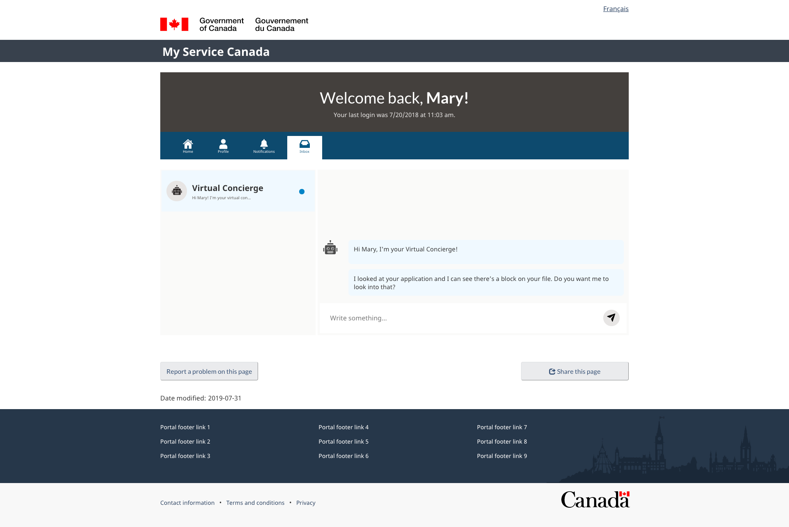

Take a look at this chatbot. Pretty standard stuff, right? And as you'd expect, when you speak to it, it speaks back. It's actually fairly impressive - it seems to understand what you're saying, and can respond coherently. This actually might be the smartest chatbot you've ever spoken to!

I have a confession - that's not a chatbot you're speaking to, but my colleague Farwa, posing as a chatbot. (Awkward). 

## Fake it 'til you make it

By faking our proposed chatbot experience, and testing it with real Employment Insurance applicants, we can establish whether or not we're building the right thing BEFORE we begin building it. Will EI applicants find this useful? Frustrating? Confusing? These are good questions to answer before we begin the costly and lengthy process of actually building an artificial intelligence-powered chatbot.

So here's our process: we contacted five people with recent experience of applying for Employment Insurance. We met with them and asked them to interact with our "chatbot". We had them go through a series of tasks, and asked probing questions throughout. This allowed us to understand what they were thinking and feeling as they interacted with our prototype. 

By carefully analyzing user behaviour and feedback, we now have hard data on what's working and what's not.  

## What we learned

We tested 11 hypotheses and learned lots of things along the way - for instance, that users do understand what a "Virtual Concierge" is, and they're comfortable with having a chatbot email their former employer on their behalf. But our most significant (and somewhat distressing) finding was around users' attitudes towards chatbots in general.

### Users distrust chatbots

Users had low expectations, probably resulting from unsatisfactory chatbot experiences in the past.

> It can be helpful for things that don't require a lot, but sometimes they aren't able to give you what you need, and you have to talk to someone.

You only get one shot...

> If I tried it once and it worked, I'd probably use it again.

... and there's very little room for error. Despite being pleased with the outcome, one small error by the chatbot caused a user to drop his rating from a five to a three.

> I feel like we got there in the end, but the fact that we had that disconcerting moment in the middle there just makes me feel a little less confident in the system ... it does shake my confidence.

We heard similar comments from each of the five users we spoke to. This will present challenges for any chatbot project. We have to build a chatbot that works well enough to convince an already skeptical user group that we aren't wasting their time.

Cross your fingers for us 🤞😬.
